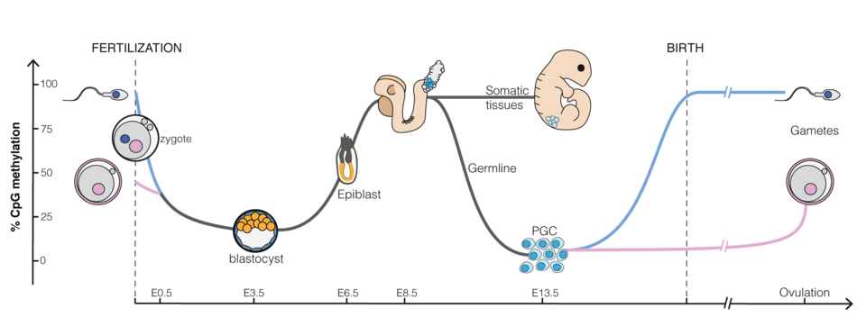
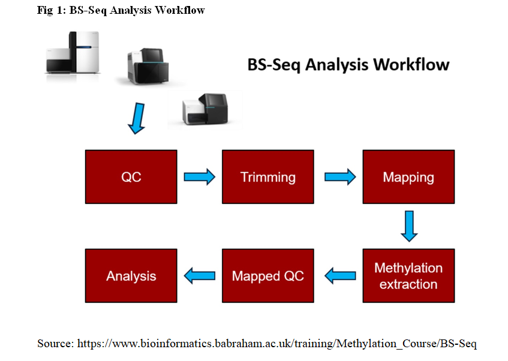
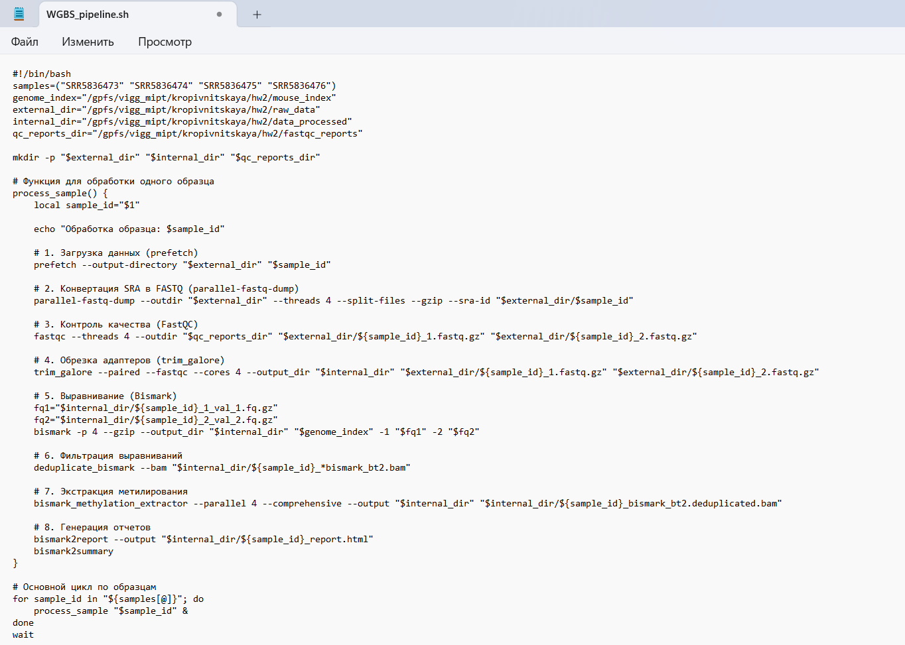

# Метилирование ДНК в раннем эмбриональном развитии мыши

**Автор: Наталия Кропивницкая**

Этот эксперимент был проведён на данных полного геномного бисульфитного секвенирования (WGBS) с парным прочтением (paired-end), полученных из Национального центра биотехнологической информации (NCBI) под именами файлов SRR5836473, SRR5836474, SRR5836475 и SRR5836476. Данные происходят из исследования, описанного в статье под названием «Epigenetic restriction of extraembryonic lineages mirrors the somatic transition to cancer». Секвенирование выполнялось с использованием платформы Illumina HiSeq 2000 и стратегии Bisulfite-Seq.

## Ранее эмбриональное развитие мыши

*Важно заметить, что картирование для этого эксперимента было ограничено мышиной хромосомой chr12.

## Короткое описание образцов:

### SRR5836473
- **ID**: 8cell_rep1_WGBS
- **Organism**: Mus musculus
- **Strategy**: Bisulfite-Seq
- **Source Name**: 	precompacted 8 cell stage embryos
- **Strain**: B6D2 F1
- **Development Stage**: E2.25
- **Tissue**: precompacted 8 cell stage embryos

### SRR5836474
- **ID**: 8cell_rep2_WGBS
- **Organism**: Mus musculus
- **Strategy**: Bisulfite-Seq
- **Source Name**: 	precompacted 8 cell stage embryos
- **Strain**: B6D2 F1
- **Development Stage**: E2.25
- **Tissue**: precompacted 8 cell stage embryos
- 
### SRR5836475
- **ID**: ICM_rep1_WGBS
- **Organism**: Mus musculus
- **Strategy**: Bisulfite-Seq
- **Source Name**: Inner Cell Mass
- **Strain**: B6D2 F1
- **Development Stage**: E3.5
- **Tissue**: Inner Cell Mass

### SRR5836476
- **ID**: ICM_rep2_WGBS
- **Organism**: Mus musculus
- **Strategy**: Bisulfite-Seq
- **Source Name**: Inner Cell Mass
- **Strain**: B6D2 F1
- **Development Stage**: E3.5
- **Tissue**: Inner Cell Mass

Вышеуказанные образцы были использованы для эксперимента с метилированием данных WGBS на различных стадиях эмбрионального развития мыши.

## Analysis Workflow

## Analysis Pipeline

## Differential Methylation Regions (DMRs) Analysis

